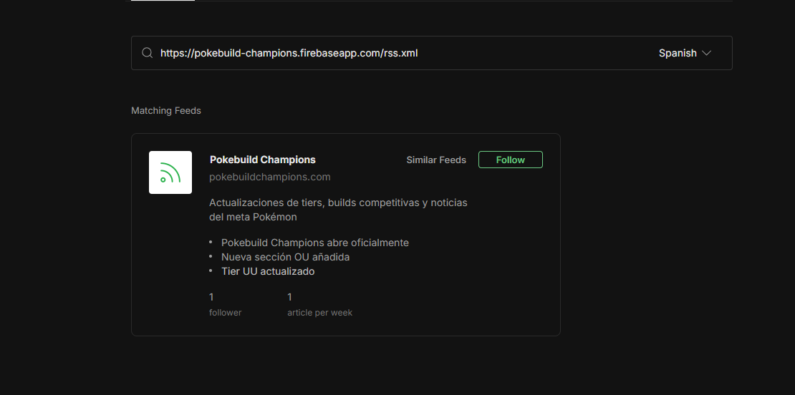
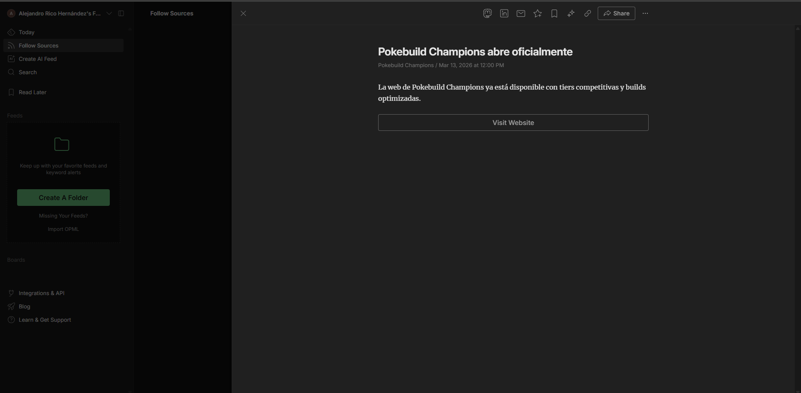

# Competitive Pokémon Web App

## Description
This web application is designed for competitive Pokémon players. It provides detailed information about Pokémon tiers, individual Pokémon stats, types, and sprites. Users can navigate through different tiers (like Ubers, OU, etc.) and view the Pokémon in each category. The main goal is to offer a clean and simple interface for trainers to quickly access competitive Pokémon data.

The app is built with React and features a responsive design to ensure a good experience on both desktop and mobile devices.

### Main Page (Home) Description
The home page serves as the central hub for trainers. It features a hero section with a welcoming banner, a grid displaying the different competitive tiers (Ubers, OU, UU, RU) allowing direct navigation to them, and a community-driven forum section. The forum implements a full CRUD system, where users can search, filter, add, edit, and delete their own competitive Pokémon strategies using mock JSON data.

## Third-Party Components
* [React Router](https://reactrouter.com/) - Used for handling page navigation.
* [React](https://reactjs.org/) - The core framework for building the frontend.
* [React Icons](https://react-icons.github.io/react-icons/) - Used to add icons throughout the interface.

## Tutorials and Resources
* [React Router Tutorial](https://reactrouter.com/en/main/start/tutorial) - Helped with routing between pages.
* [React Documentation](https://reactjs.org/docs/getting-started.html) - Core concepts for building components and managing state.
* [How to Capitalize First Letter in React](https://stackoverflow.com/questions/1026069/capitalize-the-first-letter-of-string-in-javascript) - Used for displaying Pokémon names properly.
* [Mock Data Approach](https://www.freecodecamp.org/news/how-to-use-mock-data-in-react/) - Guide for structuring and importing mock data in React.

## Design Inspiration
* [Figma Pokédex Design](https://www.figma.com/file/THLxZSlOoUYMZrjFg0Kl1M/Pok%C3%A9dex?node-id=0%3A1) - I drew inspiration from the visual structure of the cards and the base colors of this design, adapting it to a desktop web app format and focusing on the competitive meta (Smogon) instead of a traditional Pokédex.

## Features
* Tier pages showing all Pokémon in each tier.
* Individual Pokémon cards with sprite, type, and ID.
* Dynamic routing between tiers and Pokémon detail pages.
* Automatic capitalization of Pokémon names.
* Responsive layout for mobile and desktop.

## Getting Started
Follow these instructions to set up and run the project locally on your machine.

### Prerequisites
Make sure you have installed the necessary tools to run the project:
* Git
* Node.js and npm

### Installation

1. Clone the repository:
git clone https://github.com/alericohdez/Pokebuild-Champions.git

2. Navigate to the project directory:
cd Pokebuild-Champions

3. Install the dependencies:
npm install

4. Run the development server:
npm run dev

## Firebase Hosting
Our app is hosted at: [Pokebuild Champions](https://pokebuild-champions.firebaseapp.com/)

## Import Examples

To test the bulk import functionality of **PokebuildChampions**, you can download and use the following sample files:

* [Sample in JSON format](datos.json)
* [Sample in CSV format](datos.csv)
* [Sample in TSV format](datos.tsv)
* [Sample in XML format](datos.xml)
* [Sample in Excel (XLSX) format](datos.xlsx)
* [Sample in Excel Legacy (XLS) format](datos.xls)
* [Sample in OpenDocument Spreadsheet (ODS) format](datos.ods)
* [Sample in HTML Table format](datos.html)
* [Sample in Plain Text (TXT) format](datos.txt)

## RSS Feed
This is PokeBuild Champions's feed watched from a feed reader:

